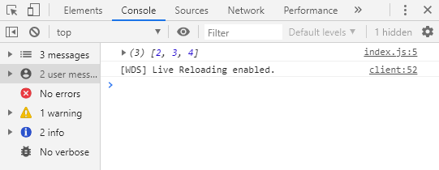
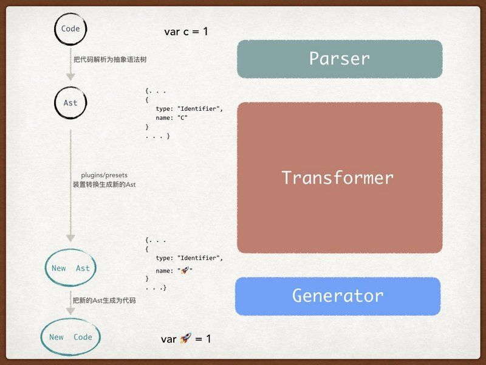
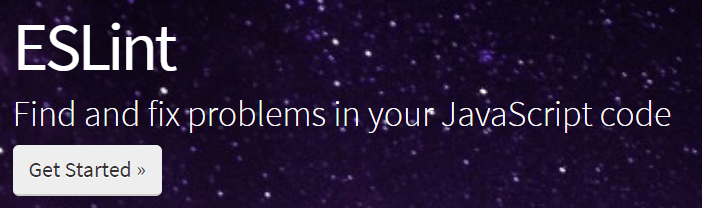

基础环境
================================

Node 版本
--------------------------------

保证电脑中安装了 Node.js。

.. code-block:: bash

    $ node -v
    v11.10.1

    $ npm -v
    6.14.4

    $ npx -v
    6.14.4

注意：这里列出的是最低要求的软件版本，在实际学习过程中最好和列出的版本保持一致。

学习环境
--------------------------------

浏览器中并不一定能够 100% 支持 ECMAScript 的所有新特性，因此需要搭建一个基础的学习环境，用于学习最新的语法。

如果想成功搭建该学习环境，需要掌握的知识点包括但不限于 `Webpack <https://webpack.js.org/>`_、`Babel <https://babeljs.io/>`_、`ESLint <https://eslint.org/>`_ 等。

搭建过程
~~~~~~~~~~~~~~~~~~~~~~~~~~~~~~~~~~~~~~~~

这个学习环境并非课程中提供的，而是个人通过 Webpack 搭建的。若想学习课程中提供的学习环境，可以查看作者的 `Github <https://github.com/cucygh/es-cli>`_ 。另外，在课程中使用了一个命令行工具 `es10-cli <https://www.npmjs.com/package/es10-cli>`_ 可以在 npm 仓库中下载下来进行学习。

**1.安装 webpack 和 webpack-cli**

.. code:: bash

    $ npm install --save-dev webpack@4 webpack-cli@3 webpack-dev-server@3 html-webpack-plugin@4

**2.指定 webpack 的入口、出口及使用的插件**

.. code:: javascript

    const path = require('path');
    const HtmlWebpackPlugin = require('html-webpack-plugin');

    const resolve = dir => path.join(__dirname, dir);

    module.exports = {
      entry: './src/index.js',

      output: {
        path: resolve('dist'),
        filename: 'index.bundle.[hash:6].js',
      },

      plugins: [
        new HtmlWebpackPlugin({
          title: 'Learn ES2019',
        })
      ],

      devServer: {
        // 不管是警告，还是错误全部展示在浏览器上
        overlay: {
          warnings: true,
          errors: true,
        },
        // 自动打开浏览器
        open: true,
        // 启动 GZip 压缩
        compress: true,
        // 关闭 host 检查
        disableHostCheck: true,
      },
    };

**3.配置开发环境及生产环境的打包命令**

.. code:: json

    "scripts": {
      "dev": "webpack-dev-server --mode development",
      "build": "webpack --mode production"
    },

**4.增加 Babel 和 ESLint 的相关模块**

.. code:: bash

    $ npm install --save-dev @babel/core@^7.9.6 @babel/preset-env@^7.9.6 babel-loader@^8.1.0 eslint@^7.1.0 eslint-config-standard@^14.1.1 eslint-loader@^4.0.2 eslint-plugin-import@^2.20.2 eslint-plugin-node@^11.1.0 eslint-plugin-promise@^4.2.1 eslint-plugin-standard@^4.0.1 html-webpack-plugin@^4.3.0

**5.增加 Babel 及 ESLint 的配置文件**

.. code:: text

    // .babel.rc
    {
      "presets": ["@babel/preset-env"]
    }

.. code:: javascript

    // .eslintrc.js

    module.exports = {
      root: true,
      env: {
        node: true,
      },
      extends: ['standard'],
      rules: {
        'comma-dangle': ['error', {
          arrays: 'never',
          objects: 'always',
          imports: 'never',
          exports: 'never',
          functions: 'never',
        }],
        // 禁止使用 alert、confirm、prompt
        'no-alert': 'error',
        // 禁止使用 var 关键字声明变量
        'no-var': 'error',
        // switch 语句最后必须有 default
        'default-case': 'error',
        // 禁止行内注释
        'no-inline-comments': 'error',
        'line-comment-position': ['error', { position: 'above', }],
        // 注释后增加空格
        'spaced-comment': ['error', 'always'],
        // if while function 后面的 { 一定要和 if 在同一行
        'brace-style': ['error', '1tbs'],
        // 空白行最多不超过两行
        'no-multiple-empty-lines': ['error', { max: 2, }],
        semi: ['error', 'always'],
      },
    };

使用方法
~~~~~~~~~~~~~~~~~~~~~~~~~~~~~~~~~~~~~~~~

如果不想跟着上面的说自己重新搭建，也可以直接 `learn-es2019 <https://github.com/negivup/learn-es2019>`_ 中下载。

**1.启动开发环境**

.. code-block:: bash

    $ npm run dev

**2.编写 src/index.js 中的代码**

.. code-block:: javascript

    let arr = [1, 2, 3];
    arr = arr.map(item => item + 1);
    console.log(arr);

**3.在浏览器的 console 中查看效果**

|console01|

基本概念
--------------------------------

简单认识一下搭建学习环境中提到的 Webpack、Babel 和 ESLint。

Webpack
~~~~~~~~~~~~~~~~~~~~~~~~~~~~~~~~~~~~~~~~

Webpack 是一个现代化的 JavaScript 应用程序静态模块打包工具。Webpack 打包的过程中会生成一个依赖图表（映射当前项目中的各个模块），最终将项目打包成一个或多个 bundle。

Webpack 中几个核心的概念，包括以下几个：

1. Entry
2. Output
3. Loaders
4. Plugins
5. Mode

Entry 是打包的入口文件，Webpack 根据这个文件寻找代码中的依赖并生成依赖图表。

.. code:: javascript

    // webpack.config.js

    module.exports = {
      entry: './path/to/my/entry/file.js'
    };

Output 打包之后的出口文件，要指定打包后的文件所在目录和打包后的文件名。

.. code:: javascript

    // webpack.config.js

    const path = require('path');

    module.exports = {
      entry: './path/to/my/entry/file.js',
      output: {
        path: path.resolve(__dirname, 'dist'),
        filename: 'my-first-webpack.bundle.js'
      }
    };

Loaders 的作用处理任意类型的文件（如图片、CSS、ES6 等），将它们转成能被 Webpack 处理的有效模块。webpack.config.js 中通过 ``module`` 来定义不同的 Loader。

.. code:: javascript

    // webpack.config.js

    const path = require('path');

    module.exports = {
      output: {
        filename: 'my-first-webpack.bundle.js'
      },
      module: {
        rules: [
          { test: /\.txt$/, use: 'raw-loader' }
        ]
      }
    };

Plugins 的作用比 Loaders 更强大，可以执行范围更广的任务。插件的范围包括打包、压缩、优化、重新定义环境变量等，插件可以处理各种各样的任务。

.. code:: javascript

    // webpack.config.js

    const HtmlWebpackPlugin = require('html-webpack-plugin'); // installed via npm
    const webpack = require('webpack'); // to access built-in plugins

    module.exports = {
      module: {
        rules: [
          { test: /\.txt$/, use: 'raw-loader' }
        ]
      },
      plugins: [
        new HtmlWebpackPlugin({template: './src/index.html'})
      ]
    };

Mode 用于定义打包的模式，有三种可选择的模式``development``、``production`` 和 ``none``，默认是 ``production``。

.. code:: javascript

    // webpack.config.js

    module.exports = {
      mode: 'development'
    };

Babel
~~~~~~~~~~~~~~~~~~~~~~~~~~~~~~~~~~~~~~~~

Babel 是一个工具链，主要作用就是将 ECMAScript 2015+ 版本的代码转换成向后兼容的 JavaScript 语法，使新语法的代码能够在低版本的浏览器或其他环境中正常执行。

.. code:: javascript

    /******* 转换前 *******/
    [1, 2, 3].map(item => item + 1);

.. code:: javascript

    /******* 转换后 *******/
    "use strict";

    [1, 2, 3].map(function (item) {
      return item + 1;
    });

Babel 的工作原理：

|babel01|

从上图可以看出，Babel 做了三件事：

1. 使用解析器将代码解析成抽象语法树（Abstract Syntax Tree）
2. 使用 plugins/presets 处理抽象语法树并生成新的语法树
3. 将最终的抽象语法树生成新的代码

Babel 在转译代码的过程中需要多种插件配合才能生成低版本浏览器需要的代码，如果不配置插件，那么 Babel 会原样输出代码。

自己手动配置插件存在各种弊端，故此官方提供了一些预设的插件集合，称为 preset。plugin 和 preset 的关系，preset 是 plugin 组成的集合。

需要注意的是，Babel 默认情况下只转译新标准引入的语法，对于新标准中引入的原生对象，部分原生对象新增的方法（如 Proxy、Set 等），这些 Babel 是不会转译的，需要自己引入 polyfill，具体可以参考 `【JavaScript】深入理解Babel原理及其使用 <https://www.jianshu.com/p/e9b94b2d52e2>`_。

ESLint
~~~~~~~~~~~~~~~~~~~~~~~~~~~~~~~~~~~~~~~~

|eslint01|

ESLint 是一个插件化、可组装的 JavaScript 和 JSX 检查工具。通过多种规则检查语法是否符合规范。规则的检查等级分为三个：

1. off 或 0 - 关闭规则
2. warn 或 1 - 警告级别
3. error 或 2 - 错误级别

